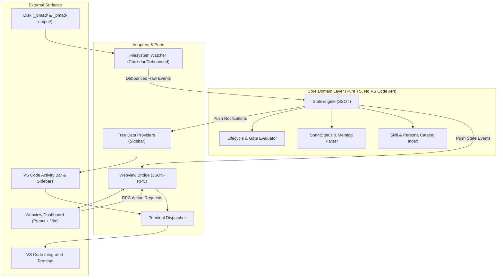
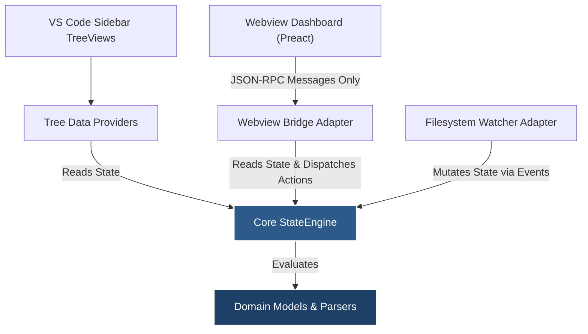

# Architecture Spine — BMAD VS Code Extension

## Design Paradigm

The extension follows a **Hexagonal (Ports and Adapters)** architecture paired with **Event-Driven Synchronization**. 

The core domain logic—comprising project detection, YAML/CSV parsing, lifecycle evaluation, gating verification, and state aggregation—is completely decoupled from the VS Code API and DOM environments into a pure TypeScript application layer (`src/core/`). 

External boundaries interact exclusively through well-defined adapters (ports):
- **VS Code UI Ports:** Native Tree Data Providers (`src/adapters/views/`), Status Bar Manager, and Command Palette controllers.
- **Webview Port:** Asynchronous JSON-RPC Message Bridge (`src/adapters/webview/`) projecting read-only state into Preact dashboard views.
- **Storage & I/O Port:** Reactive file-system watcher and file readers (`src/adapters/filesystem/`).
- **Execution Port:** Terminal dispatcher and prompt clipboard bridge (`src/adapters/execution/`).



---

## Invariants & Rules

### Dependency Direction Rules



### AD-1 — Single Source of Truth (SSOT) in Extension Host

- **Binds:** `FR-1`, `FR-2`, `FR-8`, `FR-9`, `FR-10`
- **Prevents:** State divergence, race conditions, and duplicate file I/O where Webview panels parse files independently from the sidebar tree views.
- **Rule:** The Extension Host's `StateEngine` is the sole authoritative owner of all parsed BMAD state. Webviews are read-only projection surfaces that receive immutable snapshots via the JSON-RPC bridge. Webviews must never perform direct file I/O.

### AD-2 — Webview UI Stack: Preact + Vite + Isolated Bundling

- **Binds:** `FR-8`, `FR-9`, `FR-10`, `NFR-1`, `NFR-2`, `NFR-3`
- **Prevents:** Heavy runtime bundles bloating VS Code memory, slow cold-starts, or unmaintainable vanilla DOM manipulation for interactive graphs and Kanban boards.
- **Rule:** The Webview dashboard must be implemented using **Preact** and bundled via **Vite** into `dist/webview/`. The Webview must use VS Code CSS variables (`var(--vscode-*)`) for 100% theme compatibility and enforce a strict Content Security Policy (CSP) with unique per-session cryptographic nonces.

### AD-3 — Debounced Reactive File Watching

- **Binds:** `FR-1`, `FR-10`, `NFR-1`
- **Prevents:** Disk thrashing, file locks, and CPU spikes during high-frequency agent write bursts (e.g. `bmad-build` or `bmad-loop` autonomous loops).
- **Rule:** File system events in `_bmad/` and `_bmad-output/` must pass through a **300ms trailing debounce window**. Multiple file modifications within that window coalesce into a single state recomputation cycle before pushing updates to the UI.

### AD-4 — Execution Dispatch: Terminal-First with Clipboard Fallback

- **Binds:** `FR-5`, `FR-7`, `FR-16`
- **Prevents:** Hidden background command failures, orphaned execution loops, or user disorientation.
- **Rule:** Interactive skill execution must default to launching or focusing a dedicated named VS Code integrated terminal (`"BMAD Agent"`). If terminal creation fails or is disabled by user configuration, the extension must copy the prompt to the clipboard and surface a non-blocking toast with a direct action button.

### AD-5 — Fault-Tolerant Schema Parsing with Fallback Retention

- **Binds:** `FR-2`, `FR-9`, `FR-12`, `NFR-4`
- **Prevents:** Extension crashes, blank trees, or frozen Webviews when agents or users save malformed, partial, or non-compliant YAML/CSV files.
- **Rule:** All parsers for `sprint-status.yaml`, `manifest.yaml`, `bmad-help.csv`, and `.memlog.md` must implement schema validation with graceful failure modes: on parse error, the system must retain the last known valid state, log a warning, and display a non-blocking status badge rather than throwing unhandled exceptions.

### AD-6 — Strict JSON-RPC Envelope Protocol

- **Binds:** Webview <-> Extension Host Communication
- **Prevents:** Dropped asynchronous promises, unhandled exceptions across the `postMessage` boundary, and ad-hoc message shapes.
- **Rule:** Every message across the Webview boundary must conform to the envelope `{ id: string, type: 'request' | 'response' | 'event', command: string, payload: unknown, error?: string }`. All requests from the Webview must resolve or reject within a **5000ms** timeout.

---

## Consistency Conventions

| Concern | Convention |
| :--- | :--- |
| **Naming** | Files: `kebab-case.ts`. Classes: `PascalCase`. Interfaces/Types: `PascalCase` (no `I` prefix). Methods/Vars: `camelCase`. Constants: `UPPER_SNAKE_CASE`. Events: `domain:action` (e.g., `sprint:updated`, `state:recomputed`). |
| **Data & Formats** | Dates: ISO 8601 strings (`YYYY-MM-DDTHH:mm:ssZ`). Story IDs: stable kebab strings (`1-1-user-auth`). Skill IDs: canonical IDs matching `skill-manifest.csv`. |
| **State & Errors** | Errors must use structured domain error classes (`BmadParseError`, `BmadConfigError`) carrying file paths and line numbers. Never rethrow unhandled rejections across the extension host boundary. |
| **Logging** | All diagnostic logging must route through a dedicated `vscode.OutputChannel` named `"BMAD Method"`. |

---

## Stack

| Name | Version | Role |
| :--- | :--- | :--- |
| **VS Code Engine** | `^1.85.0` | Target host platform runtime |
| **TypeScript** | `^5.4.0` | Extension host and Webview source language |
| **Node.js** | `>=18.0.0` | Extension host execution environment |
| **Preact** | `^10.20.0` | Lightweight reactive UI library for Webview dashboard |
| **Vite** | `^5.2.0` | High-speed bundler for Webview bundle |
| **esbuild** | `^0.20.0` | Ultra-fast bundler for Extension Host main thread |
| **js-yaml** | `^4.1.0` | Safe YAML parser for `manifest.yaml` and `sprint-status.yaml` |
| **csv-parse** | `^5.5.0` | Stream/sync CSV parser for `bmad-help.csv` |

---

## Structural Seed

```text
BMADExtention/
├── package.json               # Extension manifest, contributes, activationEvents
├── tsconfig.json              # Extension host TypeScript configuration
├── tsconfig.webview.json      # Webview TypeScript configuration
├── vite.config.ts             # Webview bundler config
├── media/                     # Static icons, SVGs, and base stylesheets
│   ├── icons/
│   │   └── bmad-icon.svg      # Activity Bar brand icon
│   └── styles/
│       └── base.css           # VS Code CSS variable mappings
├── src/
│   ├── extension.ts           # Extension entry point: activate() and deactivate()
│   ├── core/                  # PURE DOMAIN LAYER (Zero VS Code API dependencies)
│   │   ├── state-engine.ts    # Central state coordinator and cache
│   │   ├── config-resolver.ts # _bmad configuration and path resolution
│   │   ├── catalog.ts         # bmad-help.csv & persona indexing
│   │   ├── sprint-tracker.ts  # sprint-status.yaml parser and model
│   │   ├── memlog-parser.ts   # .memlog.md parser
│   │   └── types.ts           # Shared TypeScript models and interfaces
│   ├── adapters/              # ADAPTER LAYER
│   │   ├── views/             # Native VS Code Tree Data Providers
│   │   │   ├── lifecycle-tree.ts
│   │   │   ├── sprint-tree.ts
│   │   │   ├── agents-tree.ts
│   │   │   └── artifacts-tree.ts
│   │   ├── webview/           # Webview Panel & RPC Bridge
│   │   │   ├── dashboard-panel.ts
│   │   │   └── rpc-bridge.ts
│   │   ├── filesystem/        # Watcher & File Access
│   │   │   └── debounced-watcher.ts
│   │   └── execution/         # Terminal & Clipboard
│   │       ├── terminal-manager.ts
│   │       └── prompt-dispatcher.ts
│   └── webview/               # PREACT WEBVIEW APPLICATION
│       ├── index.html         # Webview entry HTML skeleton
│       ├── main.tsx           # Preact mount
│       ├── components/
│       │   ├── pipeline-dag.tsx   # Visual workflow pipeline
│       │   ├── kanban-board.tsx   # Sprint status interactive board
│       │   ├── agent-card.tsx     # Persona profile card
│       │   └── memlog-timeline.tsx# Chronological memory log view
│       └── hooks/
│           └── use-bmad-state.ts  # Reactive JSON-RPC hook
```

---

## Capability → Architecture Map

| Capability / Requirement | Component | Governed By |
| :--- | :--- | :--- |
| **FR-1 & FR-2 (Workspace & Path Resolution)** | `src/core/config-resolver.ts` | `AD-1`, `AD-5` |
| **FR-3, FR-4, FR-5 (Lifecycle Tree & Gating)** | `src/adapters/views/lifecycle-tree.ts` | `AD-1`, Hexagonal paradigm |
| **FR-6 & FR-7 (Agents Hub & Dispatch)** | `src/adapters/views/agents-tree.ts`, `src/adapters/execution/` | `AD-4` |
| **FR-8 (Interactive Pipeline DAG)** | `src/webview/components/pipeline-dag.tsx` | `AD-1`, `AD-2`, `AD-6` |
| **FR-9 (Sprint Kanban Board)** | `src/webview/components/kanban-board.tsx` | `AD-1`, `AD-2`, `AD-5` |
| **FR-10 (Reactive Real-Time Sync)** | `src/adapters/filesystem/debounced-watcher.ts` | `AD-3`, `AD-6` |
| **FR-11 & FR-12 (Artifacts & Memlog)** | `src/adapters/views/artifacts-tree.ts`, `src/core/memlog-parser.ts`| `AD-1`, `AD-5` |
| **FR-14 (TEA Quality & Traceability)** | `src/adapters/views/tea-tree.ts` | `AD-1` |
| **FR-15 & FR-16 (Status Bar & Commands)** | `src/extension.ts`, `src/adapters/views/` | `AD-4` |

---

## Deferred

| Decision / Feature | Reason Deferred |
| :--- | :--- |
| **Multi-Root Workspace Aggregation** | The vast majority of BMAD runs operate inside a single root directory. Supporting multiple disparate BMAD projects in one tree adds unnecessary complexity to MVP. |
| **Direct Cloud Sync (Jira / Confluence / Notion)** | The core premise of BMAD is local, file-based offline-first sovereignty. Cloud connectors belong in external tooling or dedicated sidecars. |
| **Visual Drag-and-Drop Workflow Canvas** | Authoring custom BMAD skills visually is deferred to v2. In v1, the BMB (BMad Builder) module CLI already handles skill creation and conversion. |
| **Direct LLM API Execution from Extension** | BMAD users run agents through various runners (Copilot Chat, Claude Code, Antigravity CLI, custom terminals). The extension acts as the visualizer and orchestrator, not a duplicate AI runtime. |
